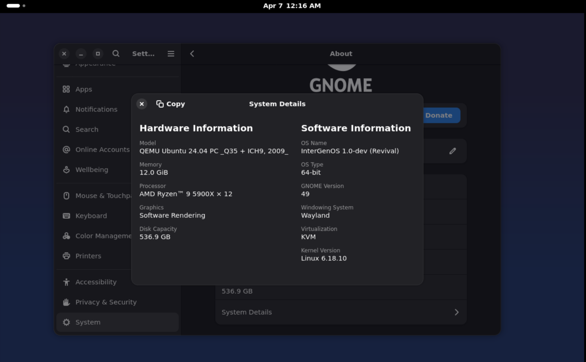
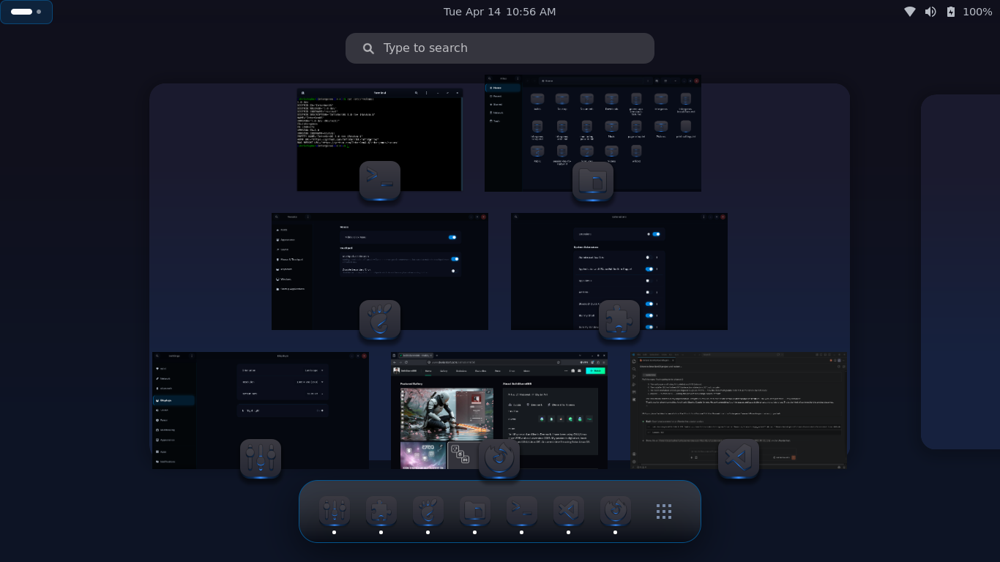
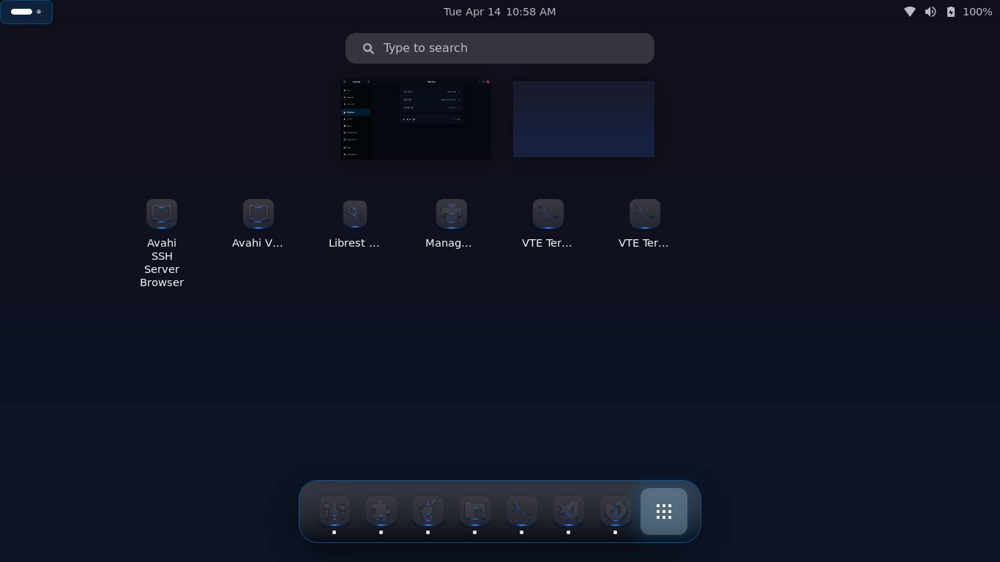
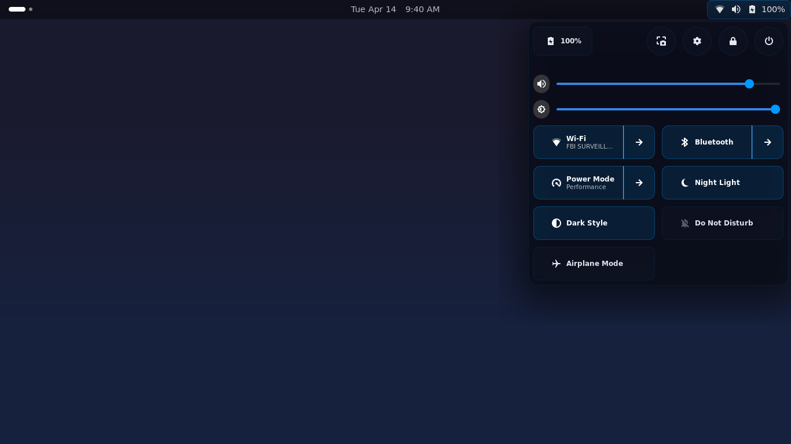
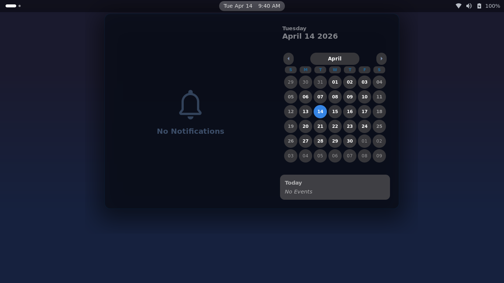
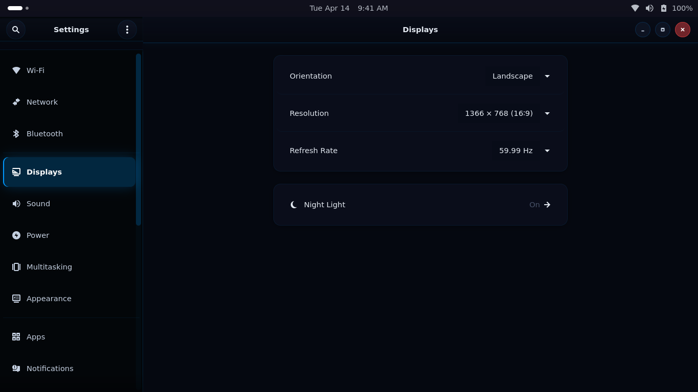

# InterGenOS

**A Linux distribution built entirely from source with a custom package manager, a tiered local AI assistant, and integrated AI-driven security auditing.**

InterGenOS puts the user in control of their own machine. Every package is compiled from source with deliberate choices. Every design decision serves one purpose: giving people a system they understand, can modify, and can trust.

**InterGen**, the local AI assistant, doesn't just help you use your system — it helps you understand and secure it. Hardware-detected tiers run it on everything from a 4 GB laptop to a GPU workstation, fully offline. For users who opt in, [Project Glasswing](https://anthropic.com/glasswing) integration brings Anthropic's vulnerability discovery capabilities directly to the desktop — scan, harden, and audit your system with the same AI that found zero-days in OpenBSD and the Linux kernel.



## Screenshots

GNOME 49.4 on Wayland with the InterGenOS shell theme.

| | |
|---|---|
|  |  |
|  |  |



Desktop shown with [Cybernetic icon theme](https://github.com/SethStormR/Cybernetic) by SethStormR.

## Security-Only Alignment

**InterGenOS is built for a world where AI-assisted vulnerability discovery is a foregone conclusion, not a theoretical threat.** Anthropic's Claude Mythos preview produced 181 working exploits where the previous generation managed 2 — and that capability will proliferate. We build this distribution assuming adversaries have superhuman vulnerability discovery and make every design decision with that in mind. Secure Boot is mandatory. Every package choice is a security choice. Nothing that hides how the system works gets shipped.

Security is not first. It is **only**.

## The Prime Directive

*InterGenOS exists to put the user in control of their own machine. Every design decision, every default, every included component must serve this purpose: giving people a system they understand, can modify, and can trust. Any complexity that doesn't serve the user — or that hides how the system works — is not welcome, regardless of how conventional it may be.*

The Prime Directive and the security-only alignment above are complementary: a machine the user cannot trust is a machine they do not control.

## Features

- **Built from source** — Based on LFS 13.0 / BLFS 13.0, every component chosen deliberately
- **Custom package manager** (`pkm`) — Natural-language CLI with SQLite + text manifest hybrid storage
- **System installer** (`forge`) — TUI-based installer powered by pkm, from partition to bootable desktop
- **Custom build system** (`igos-build`) — Python orchestrator with YAML templates, dependency resolution, and full build logging
- **BLFS package database** — 926 packages with 4,679 dependencies queryable via SQL, plus meson feature database (2,558 options across 133 packages)
- **5-distro kernel convergence** — kernel config derived from Ubuntu, Fedora, Arch, Debian, and openSUSE consensus (3,434 universal options)
- **GNOME desktop** — Wayland-native with dark theme and InterGenOS branding
- **Forge Secure Boot chain** — signed shim → MOK-signed GRUB → MOK-signed kernel → `MODULE_SIG_FORCE=y` modules. The user's own MOK key is the trust anchor; the installer generates it per machine. See [SECURITY.md](SECURITY.md).
- **Test harness** — 74 tests in `installer/tests/` covering installer backend, MOK validation, and Class 1 signing-chain verification; Phase A scaffold for GRUB `check_signatures=enforce` empirical validation.
- **Extra tier** — Node.js, Google Chrome, VS Code, and Claude Code (proprietary packages fetched transparently via pkm)
- **InterGen** — tiered local AI assistant with permission-gated tool calling, D-Bus activation, and a local LLM/voice stack (llama.cpp, whisper.cpp, Piper TTS). Hardware-detected, fully offline.
- **Project Glasswing integration** — AI-driven vulnerability scanning, system hardening, and security auditing via Anthropic API (opt-in, runtime-gated)

## Meet InterGen

**Meet InterGen — your onboard AI assistant.** Fully offline, hardware-aware, and built to understand the specific machine it's running on. At `intergen setup` time, InterGen detects your CPU, RAM, and GPU, then picks an LLM and quantization appropriate to the machine — from a 4 GB laptop on up to a GPU workstation. No cloud, no accounts, no round-trip latency.

What separates InterGen from a generic local-LLM wrapper is the permission model. Every tool call is treated as privileged: the default escalation mode is `ask`, requiring user confirmation before any action that modifies system state. Tool signatures are pinned against drift between upgrades. A separate audit log captures every tool invocation for after-the-fact review. The AI is a system component, not a hole in it.

For users who opt in, [Project Glasswing](https://anthropic.com/glasswing) integration brings Anthropic's vulnerability discovery capabilities to the desktop — scan, harden, and audit your system with the same AI that found zero-days in OpenBSD and the Linux kernel. Glasswing is the one place InterGen reaches across the network; everything else stays local by default.

See `intergen(1)` for the full command surface and `/etc/intergen/config.yml` for the default configuration.

## Tools

| Tool | Purpose |
|------|---------|
| `pkm` | Package manager — install, remove, search, verify, depends |
| `forge` | System installer — partition, deploy archives, configure, boot |
| `intergen` | Natural-language CLI to the InterGen AI assistant daemon |
| `igos-build` | Build system — source to archives with dependency resolution |
| `blfs-query` | BLFS database query tool — deps, gaps, chain-cost, versions, meson-flags, meson-audit |
| `populate-meson-db` | Meson feature database populator — parses options from source tarballs |

## Package Tiers

| Tier | Purpose |
|------|---------|
| toolchain | Cross-compilation (LFS Ch. 5-7) |
| core | Full system: kernel, shell, coreutils, systemd, GCC, SSH |
| base | CLI tools: htop, rsync, strace, screen |
| desktop | GNOME on Wayland: GTK, Mesa, GStreamer, GNOME Shell |
| ai | Local AI assistant: llama.cpp, whisper.cpp, Piper TTS, InterGen, Glasswing |
| extra | User applications: Node.js, Google Chrome, VS Code, Claude Code |

## Build System

Single command builds the entire system:

```bash
sudo bash scripts/build-intergenos.sh --user <username> --checkpoint
```

Phases: `validate → setup → toolchain → chroot-prep → chroot-tools → core → config → core-extra → kernel → desktop → extra → image`

Resume from any phase with `--start-at`, stop with `--stop-after`. Checkpoints saved after toolchain, core, kernel, and desktop phases.

## Quick Start

```bash
# Build the OS (on Ubuntu 24.04 build VM)
sudo bash scripts/build-intergenos.sh --user <username> --checkpoint

# Query the BLFS package database
python3 scripts/blfs-query.py info samba
python3 scripts/blfs-query.py deps mesa --recursive
python3 scripts/blfs-query.py chain-cost openldap

# Meson feature database — what flags does a package need?
python3 scripts/blfs-query.py meson-flags gtk4
python3 scripts/blfs-query.py meson-audit --tier desktop
python3 scripts/blfs-query.py meson-impact shaderc

# Package management (on a running InterGenOS system)
pkm install alsa-utils
pkm install-helper chrome       # Fetches from Google, installs via pkm
pkm install-helper vscode       # Fetches from Microsoft, installs via pkm
pkm install-helper claude-code  # Fetches from Anthropic, installs via pkm
pkm remove htop
pkm list installed
pkm search audio
pkm info openssh
pkm provides /usr/bin/bash
pkm verify --all
```

## Project Structure

```
intergenos/
├── igos-build/          # Build system (Python — parser, graph, builder, tracker)
├── pkm/                 # Package manager (Python — install, remove, query, verify)
├── installer/           # Forge installer (Python — TUI + backend)
├── packages/            # 654 package templates (YAML + build.sh)
│   ├── toolchain/       # LFS Ch. 5-7 (28 packages)
│   ├── core/            # LFS Ch. 8 + TLS/PAM/SSH + forge SB primitives (112 packages)
│   ├── base/            # End-user CLI tools (20 packages)
│   ├── desktop/         # GNOME desktop stack (431 packages)
│   ├── ai/              # Local AI assistant stack (2 packages)
│   └── extra/           # User-facing applications (61 packages)
├── scripts/             # Build orchestrator, chroot scripts, BLFS tools
├── data/                # Curated metadata (meson option-to-dep mappings)
├── config/              # Kernel config, systemd units, gsettings overrides
├── build/               # Sources, patches, logs, archives (not committed)
└── docs/                # LFS/BLFS reference books (not committed)
```

## Status

Active development, pre-1.0. Originally built 2015-2016 (build_001 through build_003 on GitHub). Revived March 2026.

**Now:** 654 package templates across six tiers. First successful GNOME 49.4 desktop boot on Wayland achieved April 7, 2026 — kernel 6.18.10 with config converged from 5-distro analysis, 478 packages built from source. Installer (`forge`) now handles partition → signed boot chain → image deploy → post-install hooks. Test harness covers 74 tests across installer backend, MOK validation, and Class 1 signing-chain verification.

**External reviews:** Full codebase reviewed by four external LLMs (ChatGPT, DeepSeek, Gemini, Grok) across build system, installer, orchestration, and package management. Initial audit findings all remediated; follow-on hardening continues as new edge cases surface.

Targeting first bare-metal hardware install on an HP laptop and a dual-boot install on a Zephyrus M16.

## Upcoming

Items actively in flight or planned before v1.0:

- **Forge Secure Boot bare-metal validation** — first hardware install with live MOK enrollment and end-to-end signed-chain verification.
- **Microsoft shim-review submission** — obtaining an InterGenOS-owned MS-signed shim (sponsor track; hard deadline June 27 2026 for the CA rotation).
- **Signing-key custody ceremony** — Nitrokey-based offline root, key-enrollment rotation plan, publication of fingerprints at `intergenstudios.com/signing-key`.
- **`pkm` installed as a system tool** — packaging pkm itself so `pkm install <pkg>` works out of the box on a freshly installed target.
- **VPS source mirror completion** — download-sources tooling refresh plus an upstream-version auto-poller (Components 2 and 3 of the mirror design).
- **35B AI tier scoping** — evaluating the 35-billion-parameter local-assistant tier for high-end hardware.
- **NVIDIA driver-open packaging** — fetch-helper approach for the GPL-compliant NVIDIA open modules.
- **Dual-boot Zephyrus playbook** — tested alongside-Windows install flow on shared hardware.
- **Switchable desktop environments** — v1 ships GNOME on Wayland; KDE Plasma, XFCE, and other Wayland-capable desktops planned post-v1, with the per-tier architecture already supporting the split.
- **Security Hall of Fame** — researcher acknowledgment page paired with the signing-key publication.

## History

- **2015:** build_001 — First LFS attempt
- **2016:** build_002, build_003 — 83 packages, fully automated
- **2016-2025:** Life happened. Project shelved.
- **2026:** Revival. New build system, package manager (pkm), installer (forge), BLFS database, GNOME desktop, a Secure Boot chain the user owns end-to-end, and the conviction that a from-source distribution can be both deeply educational and genuinely accessible — and that security-only alignment is not a luxury for the next decade of computing.

## Research

Every major decision is documented. See [docs/research/](docs/research/INDEX.md) — 181 markdown documents (plus supporting diagrams, data files, and external review PDFs) across 24 topical subdirectories covering:

- Why LFS over Gentoo, Buildroot, NixOS
- Build system design (9 systems evaluated)
- Package management history and design
- Kernel config convergence analysis (5 distros)
- GNOME desktop dependency chain (~370 packages)
- Application roadmap (Flathub/Snap/Arch data-driven)
- 4-LLM code review requests and responses
- Forge Secure Boot design, signing-key custody, MS shim sponsorship research
- FLUX.2 branding pipeline

## Acknowledgments

InterGenOS is built on the foundation of [Linux From Scratch](https://www.linuxfromscratch.org/) (LFS 13.0) and [Beyond Linux From Scratch](https://www.linuxfromscratch.org/blfs/) (BLFS 13.0). The LFS project and its contributors have made from-source Linux building accessible and educational for over two decades. This project would not exist without their work.

All included packages carry their own licenses as tracked in their package templates. See [CREDITS](CREDITS) for full attribution.

## License

InterGenOS build system, tools, and templates: [GNU General Public License v3.0 or later](LICENSE).

Individual packages retain their respective upstream licenses as declared in each `package.yml`.

## Author

InterGenJLU — [InterGen Studios](https://intergenstudios.com)
