# InterGenOS


**A Linux distribution built entirely from source with a custom package manager, a tiered local AI assistant, and integrated AI-driven security auditing.**

**[Website](https://intergenos.org)** · **[Documentation](https://wiki.intergenos.org)** · **[InterGen Studios](https://intergenstudios.com)**

> ### 📀 [Download InterGenOS R001](https://repo.intergenos.org/iso/intergenos-r001.iso)
> x86_64 UEFI live ISO · 9.7 GiB · sha256 `1beeb90539bc1031ad135148f379e97a1830b835350f9c7924fd7b9fc3db07c7` ([checksum file](https://repo.intergenos.org/iso/intergenos-r001.iso.sha256))
> Package mirror index signed on-hardware — [release key](https://repo.intergenos.org/keys/intergenos-release-key.asc), fingerprint `5597 A3E0 587B 2530 06D0 DD7B 8C50 8261 8208 3050`

InterGenOS puts the user in control of their own machine. Every package is compiled from source with deliberate choices. Every design decision serves one purpose: giving people a system they understand, can modify, and can trust.

**InterGen**, the local AI assistant, doesn't just help you use your system — it helps you understand and secure it. It runs on everything from a laptop with no discrete graphics to a GPU workstation, fully offline, choosing its model tier from the graphics hardware it finds. Every tier is multimodal. **InterGen Sentinel** — its pluggable security-scanner architecture — routes MCP traffic through your choice of scanner before it reaches a tool. A local-only default (`Local-Rules` rule-based + `Local-Qwen` InterGen-LLM-backed via your local Qwen model) ships ready to go. Six cloud providers are opt-in: Claude-Anthropic, Gemini-Google, CoPilot-Microsoft, ChatGPT-OpenAI, Grok-xAI, and DeepSeek. Frontier AI models in 2026 routinely surface security-relevant findings at scale — pluggable cloud routing lets users opt into that capability through whichever vendor they trust. The user picks which (if any) reaches across the network.

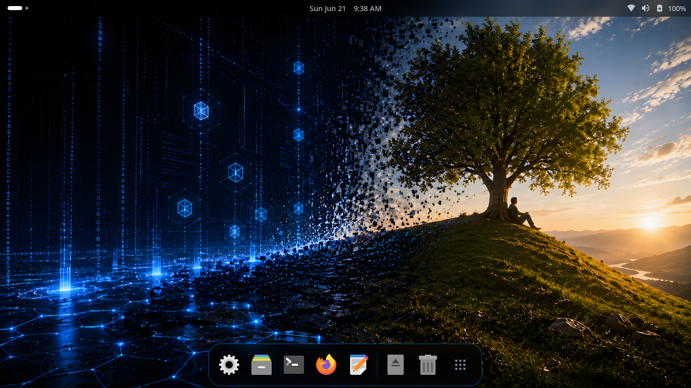

## Screenshots

GNOME 49.4 on Wayland with the InterGenOS shell theme.

| | |
|---|---|
| 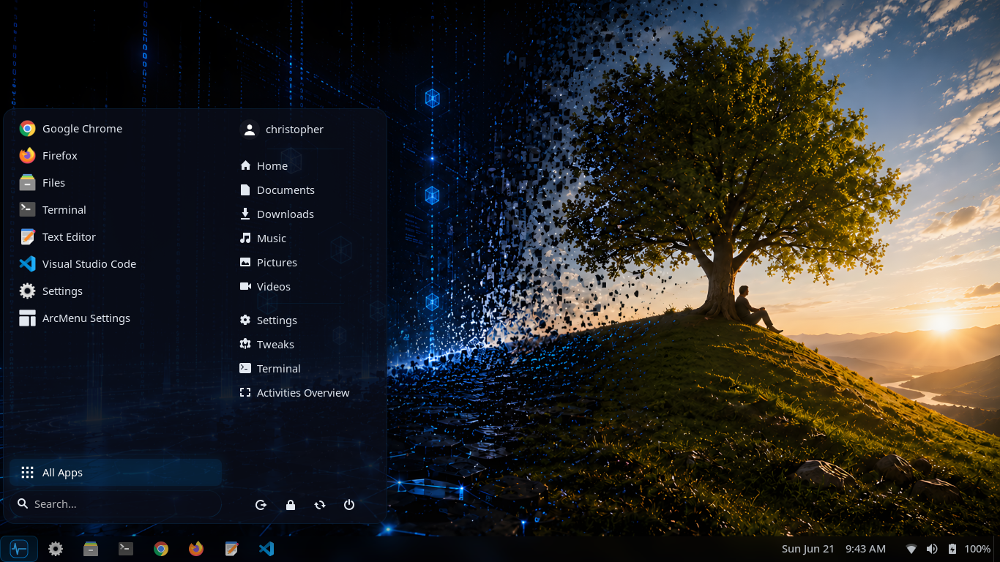 | 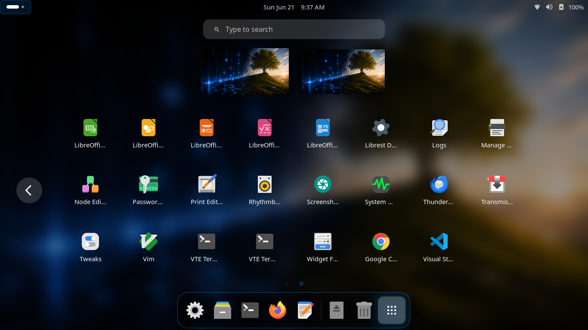 |
| 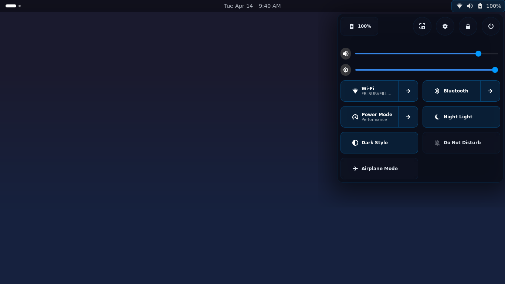 | 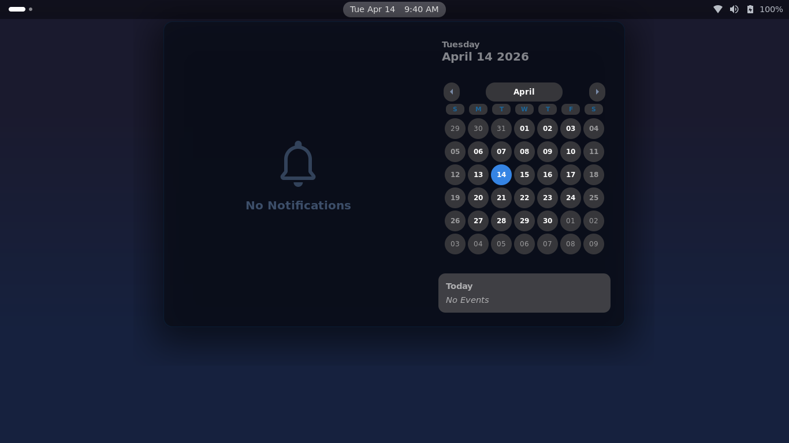 |

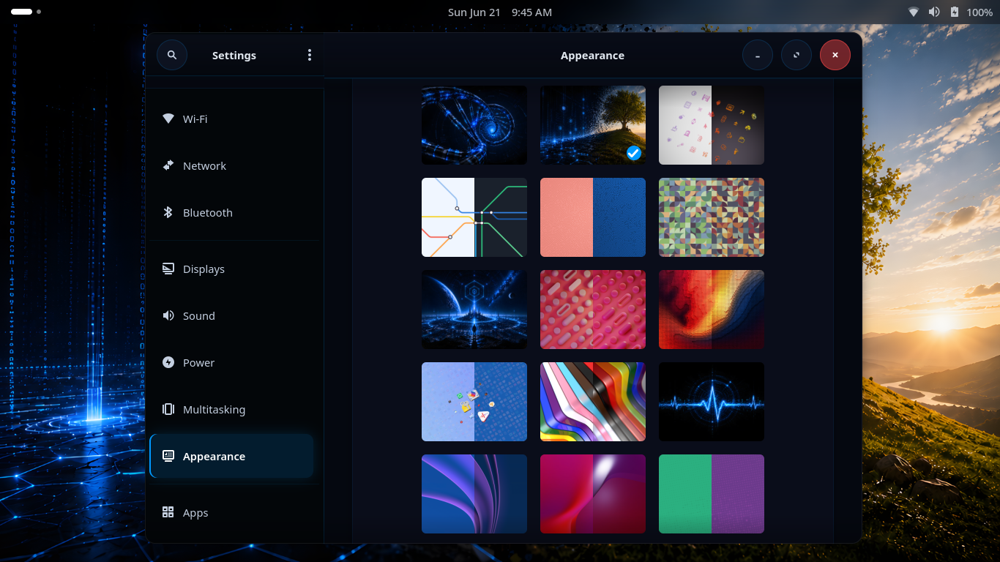

Desktop ships with the **first-party InterGenOS icon theme** as default (promoted at 1.4; it inherits Adwaita and hicolor for full application coverage). **Papirus-Dark** and the **Cybernetic Blue** icon theme by [SethStormR](https://github.com/SethStormR/Cybernetic) ship as featured alternates, switchable via Settings → Appearance or the first-boot welcomer. Typography is **Inter** for the interface paired with **JetBrains Mono** on terminal and code surfaces, over a system-wide prefer-dark colour scheme.

## Security-Only Alignment

**InterGenOS is built for a world where AI-assisted vulnerability discovery is a foregone conclusion, not a theoretical threat.** Recent frontier-AI evaluations have demonstrated working-exploit yields two orders of magnitude above the previous generation, with broad benchmark coverage across major operating systems and browsers — and that capability will proliferate. We build this distribution assuming adversaries have superhuman vulnerability discovery and make every design decision with that in mind. Secure Boot is mandatory. Every package choice is a security choice. Nothing that hides how the system works gets shipped.

Security is not first. It is **only**.

**The Forge Secure Boot chain** — each link verifies the next, anchored to a Machine Owner Key the installer generates per machine:

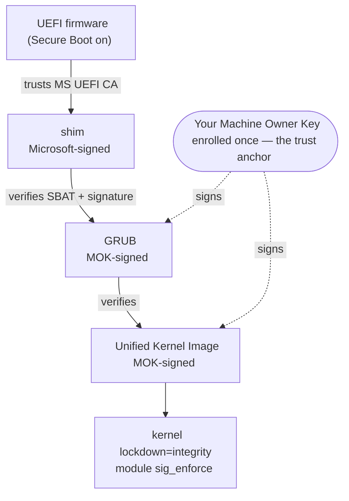
```mermaid
flowchart TD
    FW["&nbsp;UEFI firmware<br/>(Secure Boot on)&nbsp;"] -->|&nbsp;trusts MS UEFI CA&nbsp;| SHIM["&nbsp;shim<br/>Microsoft-signed&nbsp;"]
    SHIM -->|&nbsp;verifies SBAT + signature&nbsp;| GRUB["&nbsp;GRUB<br/>MOK-signed&nbsp;"]
    GRUB -->|&nbsp;verifies&nbsp;| UKI["&nbsp;Unified Kernel Image<br/>MOK-signed&nbsp;"]
    UKI --> KRN["&nbsp;kernel<br/>lockdown=integrity<br/>module sig_enforce&nbsp;"]
    MOK(["&nbsp;Your Machine Owner Key<br/>enrolled once — the trust anchor&nbsp;"]) -. &nbsp;signs&nbsp; .-> GRUB
    MOK -. &nbsp;signs&nbsp; .-> UKI
```

## The Prime Directive

*InterGenOS exists to put the user in control of their own machine. Every design decision, every default, every included component must serve this purpose: giving people a system they understand, can modify, and can trust. Any complexity that doesn't serve the user — or that hides how the system works — is not welcome, regardless of how conventional it may be.*

The Prime Directive and the security-only alignment above are complementary: a machine the user cannot trust is a machine they do not control.

## Features

- **Built from source** — Based on LFS 13.0 / BLFS 13.0, every component chosen deliberately
- **Custom package manager** (`pkm`) — Natural-language CLI with SQLite + text manifest hybrid storage
- **System installer** (`forge`) — graphical and text installer powered by pkm, from partition to bootable desktop
- **Custom build system** (`igos-build`) — Python orchestrator with YAML templates, dependency resolution, and full build logging
- **BLFS package database** — 1,030 packages with 3,948 dependencies queryable via SQL, plus a meson feature database for auditing build options across packages
- **5-distro kernel convergence** — kernel config derived from Ubuntu, Fedora, Arch, Debian, and openSUSE consensus (3,434 universal options)
- **GNOME desktop** — Wayland-native with dark theme and InterGenOS branding
- **Transparent boot** — no Plymouth splash. You watch the kernel hand off to systemd and every service start with `[OK]`/`[FAILED]`; if a mount breaks or a module misbehaves you see it the moment it happens. Spotting odd boot output is a real practice for catching compromise or hardware change — we give you that surface rather than hide it behind a logo. See [docs/users/desktop-experience.md](docs/users/desktop-experience.md).
- **Forge Secure Boot chain** — signed shim → MOK-signed GRUB → MOK-signed kernel → `MODULE_SIG_FORCE=y` modules. The user's own MOK key is the trust anchor; the installer generates it per machine. See [SECURITY.md](SECURITY.md).
- **Test harness** — over 400 tests in `installer/tests/` covering installer backend, MOK validation, install-integrity, and Class 1 signing-chain verification; Phase A scaffold for GRUB `check_signatures=enforce` empirical validation. A further over 1,400 tests across the repo-level suites under `tests/` (preflight, repo-publish, SBOM, upstream-check, download-sources, and more).
- **Extra tier** — 190+ packages spanning nine install-helpers for proprietary software (Brave, Chrome, Claude Code, Discord, Edge, Signal, Spotify, VS Code, Zoom) plus open-source applications (Firefox, LibreOffice, Audacity, GIMP, Inkscape, Thunderbird, MPV, Rhythmbox, Transmission), the Rust CLI suite (ripgrep, bat, eza, fd, hyperfine, just, starship, zoxide, and more), and container runtimes (podman, crun, conmon, netavark). Proprietary packages are fetched transparently via pkm.
- **InterGen** — tiered local AI assistant with permission-gated tool calling, D-Bus activation, and a local LLM stack (llama.cpp). Hardware-detected, fully offline, and **multimodal on every tier** — each pinned model ships a paired vision projector, and a tier whose projector is not pinned in the signed manifest is refused fail-closed rather than served without vision.
- **InterGen Sentinel** — Pluggable security-scanner architecture. `Local-Rules` (rule-based, deterministic) + `Local-Qwen` (InterGen-LLM-backed via your local Qwen model) ship by default, fully offline. Six cloud providers are opt-in: Claude-Anthropic, Gemini-Google, CoPilot-Microsoft, ChatGPT-OpenAI, Grok-xAI, DeepSeek. Schema-pinning, audit logging, and sandbox enforcement are vendor-neutral local plumbing — they apply regardless of which scanner is active.

## Meet InterGen

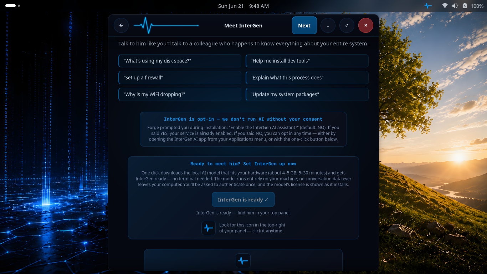

**Meet InterGen — your onboard AI assistant.** Fully offline, hardware-aware, and built to understand the specific machine it's running on. At `intergen setup` time, InterGen inspects the machine's graphics hardware and picks a model and quantization it can actually serve responsively. **Tier selection is decided by discrete-GPU presence and VRAM alone — system RAM is never an input**, because a large model held in system memory is slow enough to be the wrong answer no matter how much of it there is:

| Detected hardware | Tier served |
|---|---|
| No discrete GPU | Tier 1 — a 2-billion-parameter model, the CPU-friendly floor |
| Discrete GPU, VRAM ≥ ~7 GB | Tier 2 — a 9-billion-parameter model |
| Discrete GPU, VRAM ≥ ~22 GB | Tier 3 — a 35-billion-parameter mixture-of-experts model |
| Discrete GPU, smaller or unreadable VRAM | Tier 1 — detection fails **down**, never up |

No cloud, no accounts, no round-trip latency.

What separates InterGen from a generic local-LLM wrapper is the permission model. Every tool call is treated as privileged: the default escalation mode is `ask`, requiring user confirmation before any action that modifies system state. Tool signatures are pinned against drift between upgrades. A separate audit log captures every tool invocation for after-the-fact review. The AI is a system component, not a hole in it.

**InterGen Sentinel** routes every MCP tool call through a security scanner of your choice before it executes. The default is local-only: `Local-Rules` (rule-based, deterministic) and `Local-Qwen` (your local Qwen model reviewing the call). For richer review, opt into any of six cloud providers: Claude-Anthropic, Gemini-Google, CoPilot-Microsoft, ChatGPT-OpenAI, Grok-xAI, and DeepSeek. The user picks which (if any) reaches across the network; everything else stays on the box.

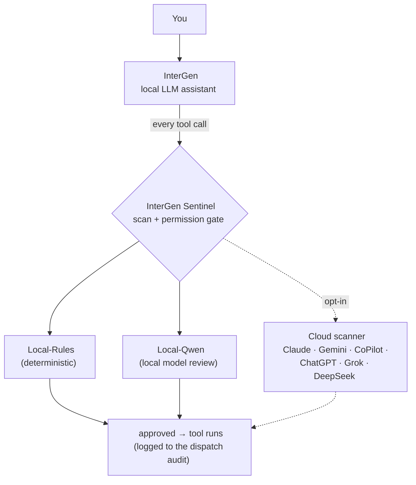
```mermaid
flowchart TD
    U["&nbsp;You&nbsp;"] --> IG["&nbsp;InterGen<br/>local LLM assistant&nbsp;"]
    IG -->|&nbsp;every tool call&nbsp;| SEN{"&nbsp;InterGen Sentinel<br/>scan + permission gate&nbsp;"}
    SEN --> LR["&nbsp;Local-Rules<br/>(deterministic)&nbsp;"]
    SEN --> LQ["&nbsp;Local-Qwen<br/>(local model review)&nbsp;"]
    SEN -. &nbsp;opt-in&nbsp; .-> CL["&nbsp;Cloud scanner<br/>Claude · Gemini · CoPilot ·<br/>ChatGPT · Grok · DeepSeek&nbsp;"]
    LR --> RUN["&nbsp;approved → tool runs<br/>(logged to the dispatch audit)&nbsp;"]
    LQ --> RUN
    CL -.-> RUN
```

See `intergen(1)` for the full command surface and `/etc/intergen/config.yml` for the default configuration.

## Tools

| Tool | Purpose |
|------|---------|
| `pkm` | Package manager — install, remove, search, verify, depends |
| `forge` | System installer — partition, deploy archives, configure, boot |
| `intergen` | Natural-language CLI to the InterGen AI assistant daemon |
| `igos-build` | Build system — source to archives with dependency resolution |
| `blfs-query` | BLFS database query tool — deps, gaps, chain-cost, versions, meson-flags, meson-audit |
| `populate-meson-db` | Meson feature database populator — parses options from source tarballs |

## Package Tiers

| Tier | Purpose |
|------|---------|
| toolchain | Cross-compilation (LFS Ch. 5-7) — 25+ packages |
| core | Full system: kernel, shell, coreutils, systemd, GCC, SSH — 300+ packages |
| base | CLI tools: htop, rsync, strace, screen — 30+ packages |
| desktop | GNOME on Wayland: GTK, Mesa, GStreamer, GNOME Shell — 450+ packages |
| extra | User applications: Node.js, Google Chrome, VS Code, Claude Code — 190+ packages |
| compute | GPU compute platform: the ROCm stack and its SDKs — 50+ packages |
| ai | Local AI assistant: llama.cpp, InterGen, InterGen Sentinel, and the model-tooling stack — 55+ packages |

Tiers build in that order. A tier's default decides whether its packages ship on
the installation image or are available from the mirror only, and individual
packages override that default either way — so **the tier is the rule, not the
shipped reality.** Of the 1,100+ package definitions, roughly three quarters ship on the image and
the rest are mirror-only, with a couple of hundred packages overriding their tier
default in one direction or the other. `compute` is
mirror-only in full; the `ai` tier ships `intergen` and `llama-cpp` on the image
and keeps the rest of the model-tooling stack on the mirror.

## Build System

Single command builds the entire system:

```bash
sudo bash scripts/build-intergenos.sh --user <username> --checkpoint
```

Phases: `validate → verify-sources → setup → toolchain → chroot-prep → chroot-tools → core → config → core-extra → base → kernel → desktop → extra → compute → ai → bootloader → image → manifest → squashfs → ukis-verity → iso`

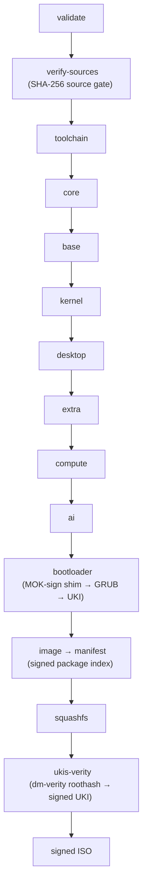
```mermaid
flowchart TD
    V["&nbsp;validate&nbsp;"] --> VS["&nbsp;verify-sources<br/>(SHA-256 source gate)&nbsp;"]
    VS --> TC["&nbsp;toolchain&nbsp;"] --> CO["&nbsp;core&nbsp;"] --> BA["&nbsp;base&nbsp;"] --> KE["&nbsp;kernel&nbsp;"]
    KE --> DE["&nbsp;desktop&nbsp;"] --> EX["&nbsp;extra&nbsp;"] --> CM["&nbsp;compute&nbsp;"] --> AI["&nbsp;ai&nbsp;"]
    AI --> BL["&nbsp;bootloader<br/>(MOK-sign shim → GRUB → UKI)&nbsp;"]
    BL --> IM["&nbsp;image → manifest<br/>(signed package index)&nbsp;"]
    IM --> SQ["&nbsp;squashfs&nbsp;"] --> UV["&nbsp;ukis-verity<br/>(dm-verity roothash → signed UKI)&nbsp;"]
    UV --> ISO["&nbsp;signed ISO&nbsp;"]
```

Resume from any phase with `--start-at`, stop with `--stop-after`. With `--checkpoint`, a restore tarball is saved after the toolchain, core, and desktop phases.

## Quick Start

```bash
# Build the OS (on Ubuntu 24.04 build VM)
sudo bash scripts/build-intergenos.sh --user <username> --checkpoint

# Query the BLFS package database
python3 scripts/blfs-query.py info samba
python3 scripts/blfs-query.py deps mesa --recursive
python3 scripts/blfs-query.py chain-cost openldap

# Meson feature database — what flags does a package need?
python3 scripts/blfs-query.py meson-flags gtk4
python3 scripts/blfs-query.py meson-audit --tier desktop
python3 scripts/blfs-query.py meson-impact shaderc

# Package management (on a running InterGenOS system)
pkm install alsa-utils
pkm install chrome              # Proprietary: fetched from Google, installed via pkm
pkm install vscode              # Proprietary: fetched from Microsoft, installed via pkm
pkm install claude-code         # Proprietary: fetched from Anthropic, installed via pkm
pkm remove htop
pkm list installed
pkm search audio
pkm info openssh
pkm provides /usr/bin/bash
pkm verify --all
```

## Try InterGenOS in a Virtual Machine

A virtual machine is the fastest way to evaluate InterGenOS without dedicated hardware. Full Forge installations are verified on **VirtualBox 7.x** and **VMware Workstation Pro**. InterGenOS is **UEFI-only** — enable EFI firmware in the VM settings; there is no legacy BIOS fallback.

| Setting | VirtualBox | VMware Workstation Pro |
|---|---|---|
| Firmware | EFI enabled | EFI enabled |
| Memory | 8 GB | 8 GB |
| Processors | 4 cores | 4 cores |
| Disk | 30 GB or larger | 30 GB or larger |
| Graphics | VMSVGA, 256 MB VRAM, 3D acceleration on | VMware SVGA |
| Network | NAT | NAT |
| Guest integration | none — do not install Guest Additions | `open-vm-tools` (not bundled VMware Tools) |

These resources give a responsive GNOME desktop and usable InterGen latency. InterGenOS will boot with as little as 4 GB and 2 cores, but at that floor the desktop and the local assistant feel noticeably slow and it is not a representative evaluation — allocate the recommended 8 GB and 4 cores. In a virtual machine InterGen runs its CPU-friendly 2-billion-parameter assistant model; the larger 9B and 35B tiers require a discrete GPU (passthrough), which most VM setups do not provide, so a VM exercises the entry tier regardless of additional RAM.

- **VirtualBox:** set the resolution in Settings → Displays after first boot (e.g. 1920×1080) on high-DPI hosts. Do not install Guest Additions — the locked-down kernel rejects unsigned out-of-tree modules by design.
- **VMware:** scales correctly out of the box using the in-tree `vmwgfx` driver with EDID support.
- Both hypervisors may log a cosmetic `failed to create vmw_framebuffer: -22` message in the live session; the display works normally.
- Both boot with Secure Boot disabled initially. The signed boot chain (shim → GRUB → UKI) is provisioned regardless; enabling Secure Boot is a one-time MOK enrollment at first boot.

**Install:** boot the ISO, choose **Install InterGenOS (Graphical)** from the GRUB menu, and follow Forge screen by screen. Nothing is written to disk until you confirm on the review screen.

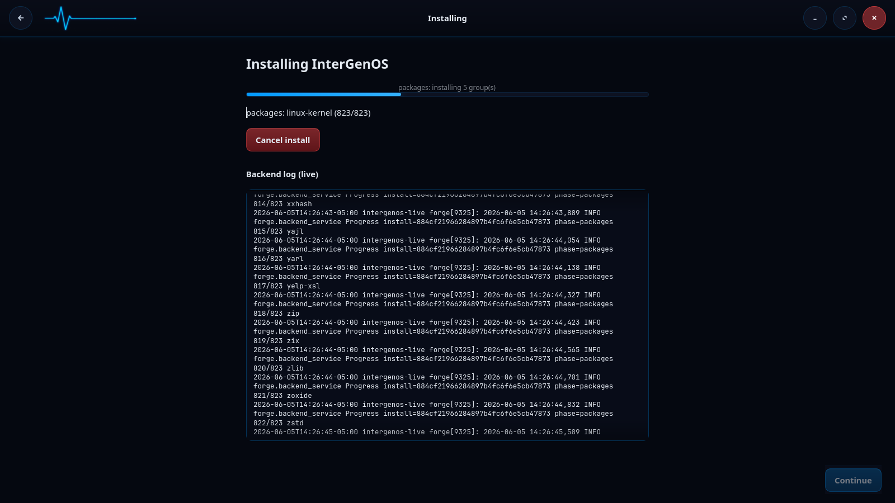

Full walkthrough: **[Virtual Machine guide](https://wiki.intergenos.org/install/virtual-machine.html)**.

## Project Structure

```
intergenos/
├── igos-build/          # Build system (Python — parser, graph, builder, tracker)
├── pkm/                 # Package manager (Python — install, remove, query, verify)
├── installer/           # Forge installer (Python — GUI + TUI + backend)
├── packages/            # 1,100+ package templates (YAML + build.sh)
│   ├── toolchain/       # LFS Ch. 5-7 cross-toolchain
│   ├── core/            # LFS Ch. 8 + TLS/PAM/SSH + Forge SB primitives
│   ├── base/            # End-user CLI tools
│   ├── desktop/         # GNOME desktop stack
│   ├── extra/           # User-facing applications
│   ├── compute/         # GPU compute platform (ROCm stack + SDKs)
│   └── ai/              # Local AI assistant stack
├── scripts/             # Build orchestrator, chroot scripts, BLFS tools
├── data/                # Curated metadata (meson option-to-dep mappings)
├── config/              # Kernel config, systemd units, gsettings overrides
├── build/               # Sources, patches, logs, archives (not committed)
└── docs/                # Project documentation, governance, security policy, and research
```

## Status

Active development, pre-1.0. Originally built 2015-2016 (build_001 through build_003 on GitHub). Revived March 2026.

**Now:** 1,100+ package templates across seven tiers (toolchain, core, base, desktop, extra, compute, ai). First successful GNOME 49.4 desktop boot on Wayland achieved April 7, 2026 — kernel 6.18.10 with config converged from 5-distro analysis. The installer (`forge`) handles partition → signed boot chain → image deploy → post-install hooks, and `pkm` ships as a system tool (`/usr/bin/pkm`) so package management works out of the box on an installed target.

**Secure Boot validated on bare metal (first hardware, July 2026).** The full signed chain — Microsoft-signed shim → MOK-signed GRUB → MOK-signed Unified Kernel Image → `MODULE_SIG_FORCE=y` modules — runs end-to-end under enforced Secure Boot, with per-machine Machine Owner Key enrollment through MokManager, after earlier end-to-end validation in a virtual machine. Kernel post-install re-signs the per-machine UKI automatically, so every kernel update stays inside the enforced chain.

**NVIDIA proprietary driver packaged** from the SHA-256-pinned upstream `.run` (open kernel modules rebuilt per machine, closed userspace repackaged). A hybrid Intel + NVIDIA laptop runs a discrete-GPU-accelerated GNOME Wayland desktop with multi-monitor output and the full EGL external-platform set; the kernel post-install hook chain — rebuild modules → MOK-sign → rebuild UKI → re-sign — is proven on hardware.

**Install-integrity verification.** A GPG-signed archive manifest is sealed into the squashfs at build time and verified offline by the installer before anything is written to disk.

**Clean installs at scale.** Multiple bare-metal installs validated with every package deploying, zero build failures, and zero failed systemd units — across current and legacy hardware, from recent laptops back to a ~2012 2nd/3rd-generation Intel Core i5, each deploying the full signed boot chain through the end-to-end ISO-installer path.

**Local assistant.** InterGen ships with hardware-tiered local models — selected from discrete-GPU presence and VRAM, failing down to the entry tier when a card is absent or its VRAM cannot be read — and code-owned, permission-gated tool dispatch as the default posture: every tool call is gated, tool signatures are pinned against drift, and every invocation is logged.

**Mirror and signing.** The public binary mirror is live at `repo.intergenos.org`, serving signed per-package archives and a signed `InterGenOS.db` index; the signing-key ceremony is complete (RSA-4096 master with hardware-token signing subkeys).

**Test harness.** over 400 tests in `installer/tests/` covering installer backend, MOK validation, install-integrity, and Class 1 signing-chain verification, plus over 1,400 tests across the repo-level suites under `tests/` (preflight, repo-publish, SBOM, upstream-check, download-sources, and more).

**External reviews:** Full codebase reviewed by four external LLMs (ChatGPT, DeepSeek, Gemini, Grok) across build system, installer, orchestration, and package management. Initial audit findings have all been remediated, and hardening continues as new edge cases surface.

## Upcoming

Items actively in flight or planned toward v1.0:

- **Microsoft shim-review submission** — obtaining an InterGenOS-owned MS-signed shim via the `rhboot/shim-review` sponsor track, so Secure Boot works out of the box without the first-boot MOK-enrollment step.
- **Public binary mirror — v1.0 archive completion** — `repo.intergenos.org` is live, serving signed per-package archives and a signed `InterGenOS.db` index; remaining work is completing full v1.0 package coverage on the mirror.
- **VPS source mirror completion** — download-sources tooling refresh plus an upstream-version auto-poller (Components 2 and 3 of the mirror design).
- **Gaming and Windows-application compatibility layer** — 32-bit multilib runtime plus a Steam / Proton / Wine stack with verified-runtime helpers, built as an optional layer on top of the base system.
- **35B AI tier bring-up** — the 35-billion-parameter mixture-of-experts tier is defined and its weights and vision projector are SHA-256-pinned in the signed model manifest; what remains is validation on high-end GPU hardware alongside the entry and mid tiers.
- **Dual-boot alongside Windows** — a tested install flow for sharing a disk with an existing Windows installation.
- **Switchable desktop environments** — v1 ships GNOME on Wayland; KDE Plasma, XFCE, and other Wayland-capable desktops are planned as additional options, with the per-tier architecture already supporting the split.
- **Security Hall of Fame** — researcher acknowledgment page maintained alongside the project's responsible-disclosure track.

## History

- **2015:** build_001 — First LFS attempt
- **2016:** build_002, build_003 — 83 packages, fully automated
- **2016-2025:** Life happened. Project shelved.
- **2026:** Revival. New build system, package manager (pkm), installer (forge), BLFS database, GNOME desktop, a Secure Boot chain the user owns end-to-end, and the conviction that a from-source distribution can be both deeply educational and genuinely accessible — and that security-only alignment is not a luxury for the next decade of computing.

## Research

Every major decision is documented. See [docs/research/](docs/research/INDEX.md) — over 180 markdown documents (plus supporting diagrams and data files) across 27 subdirectories covering:

- Why LFS over Gentoo, Buildroot, NixOS
- Build system design (9 systems evaluated)
- Package management history and design
- Kernel config convergence analysis (5 distros)
- GNOME desktop dependency chain (~370 packages)
- Application roadmap (Flathub/Snap/Arch data-driven)
- Forge Secure Boot design, signing-key custody, MS shim sponsorship research
- FLUX.2 branding pipeline

## Acknowledgments

InterGenOS is built on the foundation of [Linux From Scratch](https://www.linuxfromscratch.org/) (LFS 13.0) and [Beyond Linux From Scratch](https://www.linuxfromscratch.org/blfs/) (BLFS 13.0). The LFS project and its contributors have made from-source Linux building accessible and educational for over two decades. This project would not exist without their work.

All included packages carry their own licenses as tracked in their package templates. See [CREDITS](CREDITS) for full attribution.

## Legal

InterGenOS ships under a layered licensing posture. The summary table
below points you to the operative document for each layer; nothing
here is a substitute for those documents.

| Layer | License | Reference |
|---|---|---|
| Build system, tools, package templates, pkm, Forge, InterGen wrapper, scripts (InterGenOS-authored code) | GPL-3.0-or-later | [LICENSE](LICENSE) |
| Individual upstream packages (over 1,100 build targets and counting) | Upstream's own license (SPDX in each `package.yml`) | [CREDITS](CREDITS), [docs/governance/license-policy.md](docs/governance/license-policy.md) |
| GPL source availability | §6d network access + §6b 3-year written offer | [SOURCES.md](SOURCES.md) |
| Brand assets (name, logo, color palette, shell-theme name) | Common-law trademark; **carved out of GPL-3** | [TRADEMARK.md](TRADEMARK.md) |
| AGPL-licensed packages shipped (ghostscript, mupdf) | AGPL-3.0-or-later, with project posture not exposing as network service | [docs/governance/license-policy.md](docs/governance/license-policy.md) § 3 |
| Patent-encumbered codecs (FDK-AAC, H.264/H.265 — opt-in) | Various; default ISO ships without FDK-AAC linkage | [docs/legal/PATENTS.md](docs/legal/PATENTS.md) |
| Proprietary-fetched helpers (Chrome, Edge, VS Code, Spotify, Discord, Brave, Claude Code) | Each vendor's EULA, accepted at install time | [docs/legal/payload-licenses.md](docs/legal/payload-licenses.md) |
| Fetched-at-runtime LLM weights (via InterGen) | As declared per model in the signed model manifest — currently Apache-2.0 for every shipped entry, which the acceptance gate treats as permissive and auto-accepts | [docs/legal/payload-licenses.md](docs/legal/payload-licenses.md) |
| Privacy posture | Local-first, no telemetry; GDPR / CCPA disclosures | [PRIVACY.md](PRIVACY.md) |
| Export-control posture | ECCN 5D002 self-classified, TSU + ENC license exceptions | [EXPORT-NOTICE.md](EXPORT-NOTICE.md) |
| Contributor sign-off | Developer Certificate of Origin 1.1; `Signed-off-by:` trailer required | [DCO.md](DCO.md) |
| Vulnerability disclosure | Responsible-disclosure flow | [SECURITY.md](SECURITY.md) |
| Contributing | Issue + PR workflow | [CONTRIBUTING.md](CONTRIBUTING.md) |
| Project contributor record | Real-person identity list | [AUTHORS](AUTHORS) |

For redistributors: you inherit the project's source-availability,
trademark, and export-control obligations in your own distribution
channel. The respective documents explain what that means for you.

## Author

InterGenJLU — [InterGen Studios](https://intergenstudios.com)
