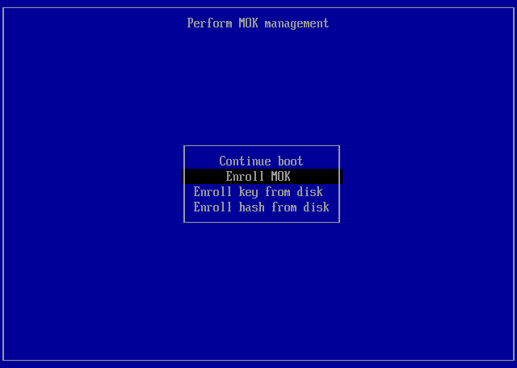
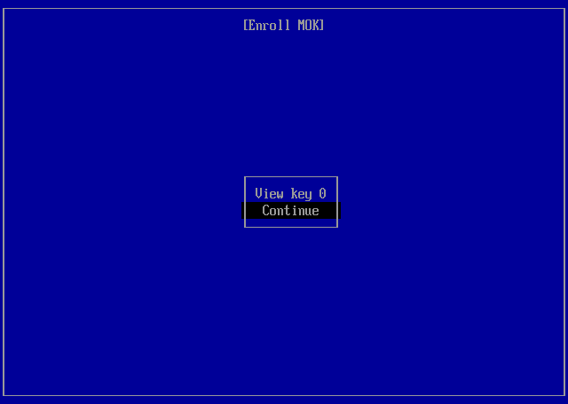
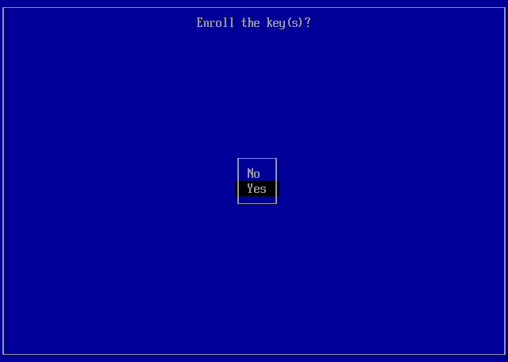
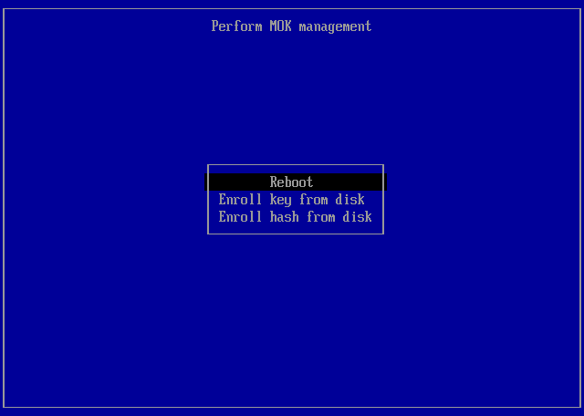

# Secure Boot and MOK on InterGenOS

This guide explains how InterGenOS uses Secure Boot, what the Machine Owner Key (MOK) is for, and what you can expect during install, first boot, and kernel upgrades.

It is written for users who want to understand the boot-chain security model: what is being verified, who signs what, and what happens when something goes wrong. It is not a developer reference. For the signing-ceremony side, see [03 — Automating release signing](../operations/03-automating-signing.md).

## The 30-second version

- InterGenOS builds a fully signed boot chain and signs every kernel image it produces. Being precise about what that *buys* you matters more than a reassuring headline, so this page is exact about what is **signed** versus what is **enforced**.
- **On the current target hardware, UEFI Secure Boot is left disabled by default, and no Machine Owner Key (MOK) is enrolled.** The signatures are present and verifiable, but firmware does not enforce them on a default install today. Secure Boot is *opportunistic*: the chain is ready for hardware where you choose to turn it on.
- The boot chain is: Microsoft CA → Fedora-signed shim → InterGenOS GRUB → InterGenOS kernel (or Unified Kernel Image).
- Every kernel the system boots is signed. Old kernels and recovery kernels too.
- The **release signing key never leaves our hardware**. We sign the live ISO and the install-mode images on our offline workstation; that key never touches your machine.
- When you install InterGenOS to disk, the Forge installer generates a per-machine **Machine Owner Key (MOK)** that lives only on your machine.
- Every kernel you install after the original ISO is rebuilt into a Unified Kernel Image and signed with your own MOK. The InterGenOS release key is never asked to sign anything you produce locally.
- If a kernel signing step fails, GRUB still offers a known-good fallback so you never end up with a system that can't boot.

## What is signed, and what is enforced

Security is not first. It is only — and "only" includes being honest about the current enforcement posture rather than implying a guarantee the shipped configuration does not yet provide. Two things are easy to conflate:

- **Signed** — the artifact carries a cryptographic signature you (or the firmware) can verify. InterGenOS signs the shim chain, GRUB, and every kernel UKI.
- **Enforced** — the firmware refuses to run anything whose signature does not validate. Enforcement requires UEFI Secure Boot to be *on* and the relevant key (Microsoft's CA via shim, plus your MOK) to be trusted.

On a default install of the current fleet, the chain is signed but **not** firmware-enforced, because Secure Boot is disabled and no MOK is enrolled. What that gives you today:

- **Verifiable install media.** The live ISO and install images are signed offline; you can verify them before you ever install.
- **A sealed live image.** dm-verity over the live ISO's read-only squashfs means a tampered install medium cannot present itself as genuine.
- **A signing path that is ready to enforce.** Because every installed kernel is already built into a signed UKI, enabling Secure Boot on capable hardware (and enrolling the MOK) turns the existing signatures into enforced ones without re-architecting anything.

What it does **not** give you on a default install is a hardware-rooted guarantee that only signed code boots — that is what enabling Secure Boot adds. The boot path is the most privileged code on any machine: if an attacker can substitute a kernel before the OS finishes starting, every other defense the OS provides is moot. The signed chain is what makes closing that gap a firmware-toggle away rather than a re-architecture.

## The boot chain

```
   Firmware (UEFI)
        │
        │  trusts Microsoft 3rd-party CA   (only checked when Secure Boot is ON)
        ▼
   Fedora-signed shim                  (we piggyback Fedora's shim
        │                               for v1.0; a parallel
        │  trusts InterGenOS vendor     submission produces our own
        │  cert (loaded as MOK)         MS-signed shim for later)
        ▼
   InterGenOS GRUB                     (signed by the release key for
        │                               the live ISO and install media,
        │  enforces signature           or by your local MOK for the
        │  verification on UKIs         GRUB written to your disk
        ▼                               during install)
   InterGenOS UKI                      (vmlinuz + initramfs +
   (or kernel + initramfs)              cmdline, bundled and signed
        │                               as a single Authenticode
        │  Linux kernel handoff         binary by systemd-stub)
        ▼
   InterGenOS userspace
```

A Unified Kernel Image (UKI) is a single signed file that bundles the kernel, the initramfs, and the kernel command-line. Signing the UKI envelope signs all three at once; nothing inside can be swapped without breaking the signature. The chain above is enforced from the firmware downward only when Secure Boot is enabled; with it disabled (the default on the current fleet), the same artifacts are present but the firmware does not gate on them.

The live ISO and install media use UKIs signed by our release subkey (held on a hardware token at our offline signing workstation). Once you install to disk, every kernel you install or upgrade is rebuilt into a UKI on your machine and signed with your machine's MOK.

## What is a MOK?

A Machine Owner Key is a per-machine signing key, generated on your own machine, that the firmware trusts because you enrolled it via MokManager at first boot.

It exists for two reasons:

1. **Your machine signs the kernels you install.** When you install a new kernel (`pkm install linux-kernel-X.Y.Z`), InterGenOS rebuilds the UKI and signs it with your MOK. The InterGenOS release key never sees the kernels you install; it only signs the live ISO and install media that ship from us.
2. **You can trust your own third-party drivers.** If you build out-of-tree modules (e.g., proprietary GPU drivers via DKMS), they can be signed by your MOK and load on a Secure Boot system without disabling enforcement.

The MOK is yours. It lives at `/var/lib/intergen/mok/` on the installed system. If you reinstall, Forge generates a fresh MOK; if you migrate to a new machine, you generate a new MOK there.

## The Forge install flow

**Install with Secure Boot turned OFF.** The installed system's boot chain is signed with a MOK your firmware does not trust yet, so the supported order is: disable Secure Boot in UEFI setup before installing, set the enrollment password in Forge, then re-enable Secure Boot on the first reboot — that re-enable is what triggers enrollment. The three steps in full are in the [MOK enrollment runbook](../mok-enrollment.md).

Forge asks you for exactly one thing on this subject — the enrollment password. With that in hand, the bootloader stage does the following without asking you any further questions:

1. **Generates a per-machine MOK keypair** (RSA-2048, matching the kernel module-signing default) at `/var/lib/intergen/mok/mok.key` (private key), `/var/lib/intergen/mok/mok.crt` (PEM-format X.509 cert, used by `sbsign` for UKI signing), and `/var/lib/intergen/mok/mok.der` (DER-format X.509 cert, the binary form MokManager wants for enrollment).
2. **Prompts you to set an enrollment password** in the **Secure Boot enrollment** section of the installer (a password you choose; printable-ASCII, 8–256 characters — leave it blank to skip MOK enrollment) and stages it for the first-boot enrollment step.
3. **Stages the MOK for enrollment** so MokManager picks it up on the next reboot.
4. **Ensures the UKI tooling is present** — `ukify` (which ships with the systemd tooling) and `sbsign` (from `sbsigntool`) are ordinary installed packages, so the linux-kernel package's post-install hook can build and sign UKIs at kernel install or upgrade time.
5. **Installs an initial UKI** built from the kernel the installer just dropped on the system, signed with the freshly-generated MOK.
6. **Configures a recovery boot entry** that loads the bare vmlinuz with no UKI envelope, as a fallback path if a UKI ever fails to sign or boot.

The password is the one **you chose** during install — Forge never generates one, never displays it back, and never writes it to any log. Remember it (or note it somewhere safe before you reboot); you will need it once, during MokManager enrollment at first boot.

If you forget the password before enrolling, you can re-stage enrollment with a new one (`mokutil --import`), or reinstall for a fresh MOK — see [Recovery](#recovery) below.

## First-boot MOK enrollment

MOK enrollment only matters when you intend to run with Secure Boot **enabled**. If you leave Secure Boot off, the firmware never gates on the MOK and the MokManager step never runs — the enrollment simply stays queued, which is not a failure.

**Turning Secure Boot back on is what triggers enrollment.** After Forge finishes, enter UEFI firmware setup on that first reboot and re-enable Secure Boot (the setting you turned off before installing), then save and boot. Only with Secure Boot on does the firmware load shim, and MokManager is part of shim.

On that boot, shim notices the pending MOK enrollment request and runs **MokManager** before continuing. MokManager is a small blue-text-on-black-background utility that walks you through four screens (captured below from a real enrollment):

1. **"Perform MOK management"** — press any key to start, then choose **Enroll MOK**.

   

2. **"Enroll MOK"** — review the certificate that is about to be enrolled. The certificate subject will read `CN=InterGenOS Machine Owner Key`. Confirm.

   

3. **"Enroll the key(s)?"** — answer **Yes**, then type the enrollment password you set during install at the **"Enter password"** prompt. The password is single-use; once enrollment completes, you will not be prompted for it again.

   

4. **Reboot** — the menu returns with your key enrolled; choose **Reboot** to continue.

   

After enrollment, MokManager exits and the system boots into InterGenOS normally. From that point on, the firmware trusts your MOK; UKIs signed with that key load without further prompts.

If you are running with Secure Boot enabled and do not enroll the MOK at first boot (for example, you reboot during MokManager and skip the enrollment), the system will still boot using the InterGenOS-release-signed UKI that shipped with the installer image. But the next kernel install or upgrade — which produces a UKI signed with your MOK — will not be trusted by the firmware, and Secure Boot will refuse to load it; you will fall through to the recovery boot entry until you enroll the MOK. With Secure Boot disabled (the default), enrollment is not required and the locally signed UKIs load regardless.

## Kernel install and upgrade

When you install or upgrade a kernel via `pkm install linux-kernel-X.Y.Z` (or any package whose post-install hook touches the kernel), the linux-kernel package's `post_install` hook does the following on your machine, with no key material from the InterGenOS release infrastructure:

1. Reads the kernel, the standard initramfs (and an additional FDE initramfs if your system is LUKS-encrypted — see below), and the canonical command-line for your system.
2. Runs `ukify build` to bundle them into a single UKI in the systemd-stub envelope.
3. Runs `sbsign --key /var/lib/intergen/mok/mok.key --cert /var/lib/intergen/mok/mok.crt` to sign the UKI. (`sbsign` reads PEM-format certificates; the `.der` form generated alongside is for MokManager enrollment only, not signing.)
4. Writes the signed UKI to `/boot/efi/EFI/Linux/intergenos-<kernel-version>.efi`.
5. Updates the GRUB menu so the new kernel is the default boot entry.
6. Retains a configurable number of old kernels (default: 2) and their UKIs as fallback entries.

The InterGenOS PIV slot 9c key, used for release signing on our offline workstation, is never asked. It physically does not exist on your machine.

If signing fails (key file corrupt, ESP full, etc.), the linux-kernel post-install hook falls back to the GRUB-loads-vmlinuz path: the kernel and initramfs are written out separately and GRUB loads them directly. (When Secure Boot is enabled, GRUB itself is signed and enforces `check_signatures=enforce`; with Secure Boot off, that gating is not active, but the fallback path still gets you a bootable system.) You do not end up with a system that has a half-installed kernel.

## ESP sizing

Because every kernel you install becomes a signed UKI in `/boot/efi`, the ESP needs enough headroom for several generations of kernel. A typical UKI is 80–150 MB depending on the initramfs payload. Forge creates a fixed **1 GiB** EFI System Partition during partitioning, which leaves room for several kernel generations plus their fallbacks.

If your ESP fills up, kernel install will fail. The linux-kernel post-install hook prints a clear message; you can clean up old kernels with `pkm remove linux-kernel-<old-version>` to free space.

## Composition with LUKS encryption

If you chose the encrypted-install option, Forge installs a small full-disk-encryption initramfs alongside the kernel: busybox plus cryptsetup, just enough to prompt for your LUKS passphrase and unlock the root volume before the kernel hands off to the system's userspace.

That FDE initramfs is bundled into the same UKI as the kernel. The UKI signature covers it, just as it covers the kernel and the command-line. There is one signature; verifying the UKI signature verifies the entire boot path including the LUKS unlock prompt.

If you opt for TPM2-sealed unlock (an experimental feature not offered by the installer in this release — see [Full Disk Encryption](full-disk-encryption.md)), the same UKI envelope holds the additional bits that talk to your TPM. The unlock path is still inside the signed envelope; the TPM is not a way to skip Secure Boot verification.

For non-encrypted installs, the UKI's bundled initramfs is minimal — typically only CPU microcode — because all storage and filesystem drivers are built into the kernel. The bootloader does not need an initramfs to find the root volume.

## Recovery

Most of the time you will never think about any of this. When something goes wrong, you have several recovery paths.

### "I forgot the MOK enrollment password"

On a default install (Secure Boot off), this has no effect on booting: enrollment is not required and your locally signed UKIs load regardless. The enrollment password only matters when you intend to enable Secure Boot.

The MOK material lives under `/var/lib/intergen/mok/`. There is no separate recovery wrapper command — UKI signing is handled entirely by the kernel package's post-install hook. To start fresh, reinstalling with Forge generates a new MOK and lets you set a new enrollment password; a subsequent kernel install or upgrade rebuilds the UKIs with it.

### "MokManager rejected my password"

You may have mistyped a character — firmware text prompts are often US-QWERTY regardless of the layout you chose at install. MokManager allows three attempts, then reboots. You can try again, or reinstall to get a fresh MOK and set a new password as described above.

### "Secure Boot is refusing my new kernel"

This applies only with Secure Boot enabled. It usually means the MOK was not enrolled (or was un-enrolled) but the kernel post-install hook signed a UKI with it. Boot the recovery entry (load the bare vmlinuz directly via GRUB), then re-enroll the MOK via MokManager.

### "I want to run an unsigned kernel for testing"

On a default install (Secure Boot off) nothing stops you, but the supported path is to build your kernel, sign it with your MOK using `sbsign`, and install it through the package manager like everything else — so the machinery stays consistent for the day you enable Secure Boot. If you need to test bare unsigned kernels with Secure Boot on, do it in a VM where Secure Boot is off, not on a production install.

## Troubleshooting

| Symptom | Likely cause | Fix |
|---|---|---|
| Boot stops at MokManager every time | MOK enrollment never completed; firmware re-prompts each boot | Complete enrollment; see [First-boot MOK enrollment](#first-boot-mok-enrollment) above. |
| New kernel installs but won't boot, falls through to recovery | UKI signed with a MOK the firmware doesn't trust | Re-enroll the MOK, or re-run the kernel post-install hook after enrollment. |
| GRUB menu shows only the recovery entry, no UKI entries | UKI signing has been failing silently | Inspect `/var/log/intergen-kernel-postinstall.log` for sign errors. ESP-full and missing MOK key file are the two common causes. |
| `ukify` or `sbsign` is missing on the installed system | The UKI tooling packages were removed | Reinstall the `systemd` tooling (which provides `ukify`) and `sbsigntool` with `pkm`, then re-run the linux-kernel post-install hook for the current kernel. |
| Secure Boot toggle in firmware is greyed out | Some firmware (especially OEM laptops) makes Secure Boot read-only outside Setup Mode | See your hardware vendor's documentation for entering Setup Mode. InterGenOS runs fine with Secure Boot off (the default); enabling it is optional. |

## Further reading

- [Security Defaults](security-defaults.md) — the at-a-glance summary of every default protection InterGenOS enforces.
- Three design decisions shape the boot chain described here: the live ISO ships Fedora's pre-signed shim for v1.0, installed systems sign every per-kernel UKI with the user's own MOK, and encrypted installs fold the LUKS unlock into the signed UKI.
- [03 — Automating release signing](../operations/03-automating-signing.md) — the documentation for how the live ISO and install media get signed (the upstream side of the boot chain described here).
- [Getting Started](../getting-started.md) — install walkthrough that references the MOK enrollment step in context.
- [Security Policy](../../SECURITY.md) — how to report a vulnerability in any part of this boot chain.
